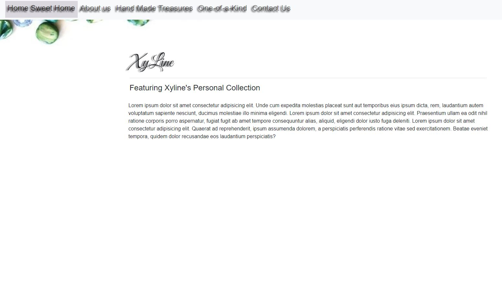

# Xys Tiny Finds

## Table of contents

- [Overview](#overview)
  - [The challenge](#the-challenge)
  - [Screenshot](#screenshot)
  - [Links](#links)
- [My process](#my-process)
  - [Built with](#built-with)
  - [What I learned](#what-i-learned)
  - [Continued development](#continued-development)
- [Author](#author)

## Overview

### The challenge

Users should be able to:

- View the optimal layout for the app depending on their device's screen size
- See hover states for all interactive elements on the page
- Select and submit a number rating
- View variaty of jewelry products

### Screenshot

### Links

- Live Site URL: [View](https://camkol.github.io/xystinyfind/)

## My process

- I undertook the development for a close friend's company.
- Striving for consistency, I emulated the design of their old website, then enhance upon request.
- Bootstrap was incorporated to enhance structural elements.
- A JavaScript-based slideshow was implemented for visual appeal.
- Leveraging my Photoshop skills, I converted images to JPG format to enhance accessibility and reduce file sizes, subsequently improving load times.

### Built with

- Semantic HTML5 markup
- [Bootstrap](https://getbootstrap.com/) - CSS library
- CSS custom properties
- [Sass](https://sass-lang.com/) - Preprocessor scripting language
- Flexbox
- CSS Grid
- Mobile-Responsive Design
- JavaScript - Scripting language
- [jQuery](https://jquery.com/) - JS library
- [Photoshop](https://www.adobe.com/products/photoshop.html) - Image editor

### What I learned

This was my first project that I did on my own. Updated it as I learning more lessons and techniques.

**Note: Delete this note and the content within this section and replace with your own learnings.**

### Continued development

Will continue to improve it to from gained knowledge and client's request.

**Note: Delete this note and the content within this section and replace with your own plans for continued development.**

## Author

- Website - [Cameron Howze](https://camkol.github.io/)
- Frontend Mentor - [@camkol](https://www.frontendmentor.io/profile/camkol)
- GitHub- [@camkol](https://github.com/camkol)
- LinkedIn - [@cameron-howze](https://www.linkedin.com/in/cameron-howze-28a646109/)
- E-Mail - [cameronhowze4@outlook.com](mailto:cameronhowze4@outlook.com)
